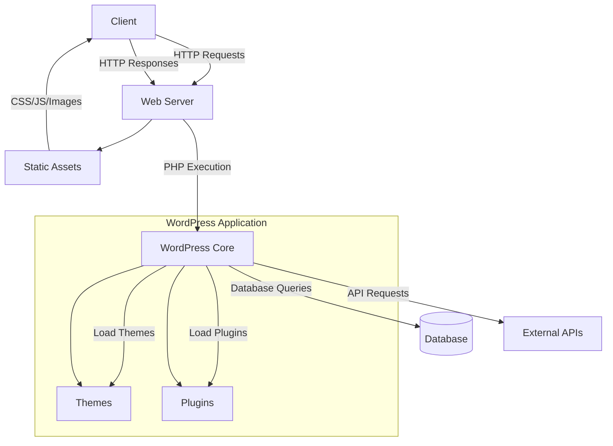
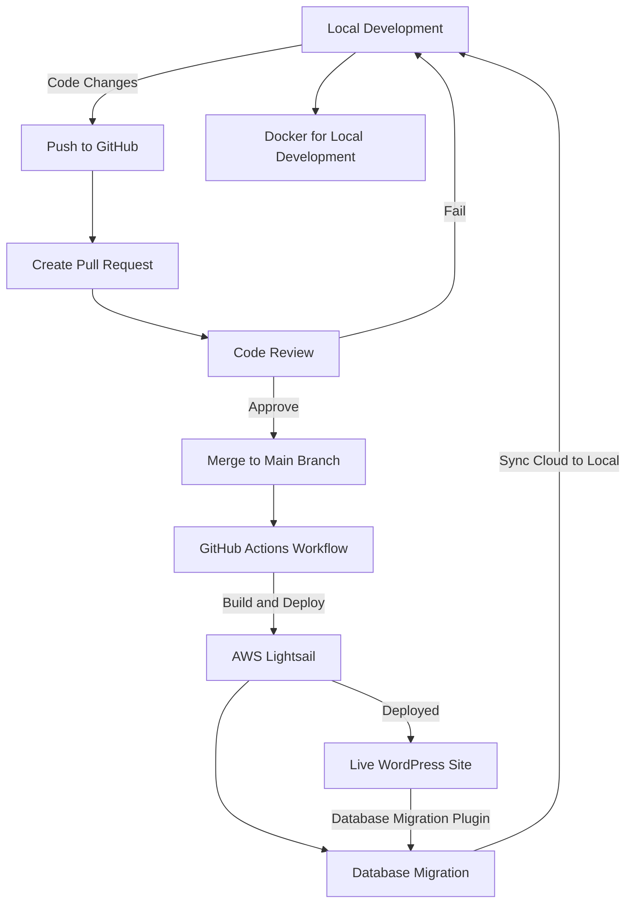

# Week 1 Introduction

Welcome to the **WordPress Camp** project! This project serves as a comprehensive guide to creating and managing a basic website using WordPress, HTML, CSS, and JavaScript. It includes a lecture, practical examples, and a sample project to help you understand the fundamentals of web development with WordPress.

## Introduction

This project is designed to provide a detailed walkthrough of building a simple yet functional website using WordPress, enhanced with custom HTML, CSS, and JavaScript. It is aimed at beginners who want to learn the basics of web development and WordPress customization.

## Setup

1. **File Structure**

wordpress-camp/

    ├── index.html
    ├── styles.css
    └── script.js

# WordPress Project Architecture

This diagram represents a high-level architecture of a WordPress project.

# Work Flow

# Homework
You can find the sample and repo here ⬇️

[sample link 📝](http://first-week.s3-website-ap-southeast-2.amazonaws.com/)

[repo link 📂](https://github.com/RuntaoZhuge/wordpress-camp/tree/main/week-1)

